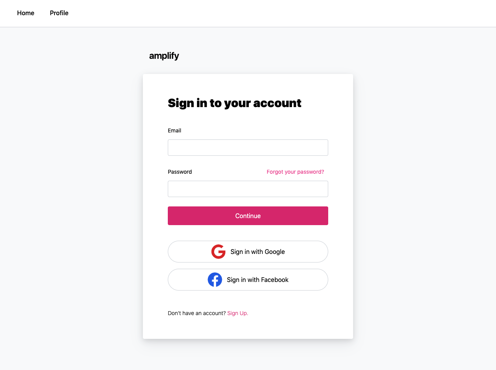

# Building an authentication flow with Next.js, TailwindCSS, and AWS Amplify



## To deploy this app:

1. Clone the project & install dependencies

```sh
git clone git@github.com:dabit3/next.js-tailwind-authentication.git

npm install

# or

yarn
```

2. Create your Facebook and Google OAuth App IDs

3. Initialize the Amplify project'

```sh
amplify init
```

4. Deploy the back end services

```sh
amplify push --y
```

5. Run the app locally:

```sh
npm run dev
```